# TP DevOps – Nour Kidoudi

Mise en place d'une VM Ubuntu Server 26.04 avec accès SSH sécurisé, Docker et Jenkins, puis création d'un mini CV versionné sur GitHub et push via SSH.

**Environnement :** VMware, Ubuntu Server 26.04 LTS (resolute), réseau NAT `192.168.237.0/24`, VM en `192.168.237.130`, machine physique sous Windows (PowerShell).

---

## 1. Installation d'Ubuntu Server 26.04 et accès SSH sécurisé

Installation d'Ubuntu Server 26.04 avec l'option **Install OpenSSH server** cochée. Vérification du service et de l'IP :

```bash
sudo systemctl status ssh
ip a
```

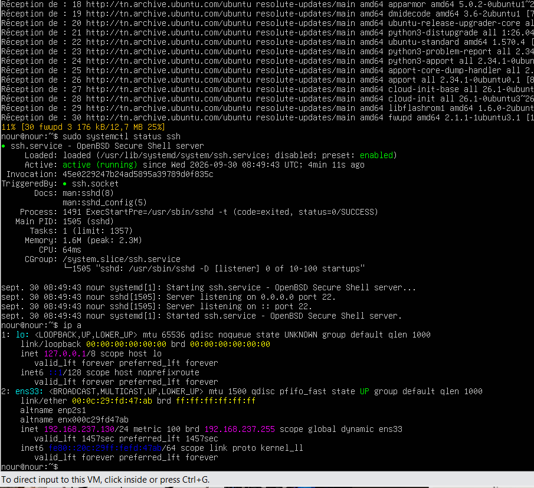

Génération d'une clé Ed25519 sur la machine physique et copie vers la VM :

```powershell
ssh-keygen -t ed25519 -C "nour-vm"
type $env:USERPROFILE\.ssh\id_ed25519.pub | ssh nour@192.168.237.130 "mkdir -p ~/.ssh && chmod 700 ~/.ssh && cat >> ~/.ssh/authorized_keys && chmod 600 ~/.ssh/authorized_keys"
```

Un avertissement `REMOTE HOST IDENTIFICATION HAS CHANGED` est apparu, car l'IP avait été utilisée par une ancienne VM. Correction :

```powershell
ssh-keygen -R 192.168.237.130
```

Durcissement de SSH, dans `/etc/ssh/sshd_config.d/99-hardening.conf` :

```
PermitRootLogin no
PasswordAuthentication no
PubkeyAuthentication yes
MaxAuthTries 3
```

```bash
sudo sshd -t && sudo systemctl restart ssh
sudo ufw allow OpenSSH
sudo ufw allow 8080/tcp
sudo ufw enable
sudo ufw status
```

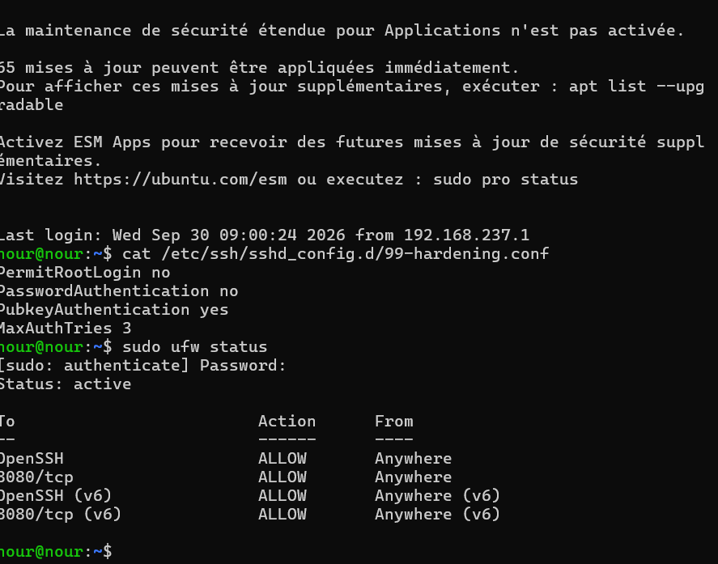

---

## 2. Test de l'accès SSH depuis la machine physique

```powershell
ssh nour@192.168.237.130
hostname && lsb_release -a
```

Connexion réussie par clé, sans mot de passe.

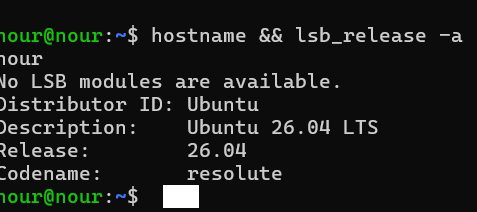

---

## 3. Installation de Docker sur la VM

```bash
sudo apt update && sudo apt upgrade -y
sudo apt install -y docker.io
sudo systemctl enable --now docker
sudo usermod -aG docker $USER && newgrp docker
docker --version
docker run hello-world
sudo systemctl status docker
```

> Docker est installé depuis les dépôts Ubuntu (paquet `docker.io`, version 29.1.3).

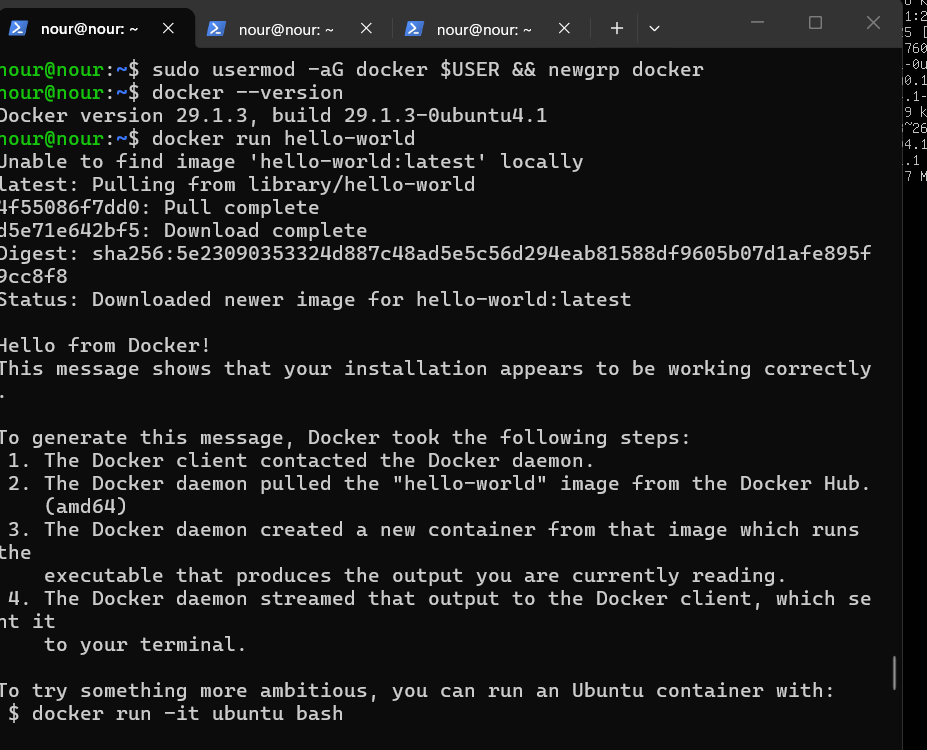
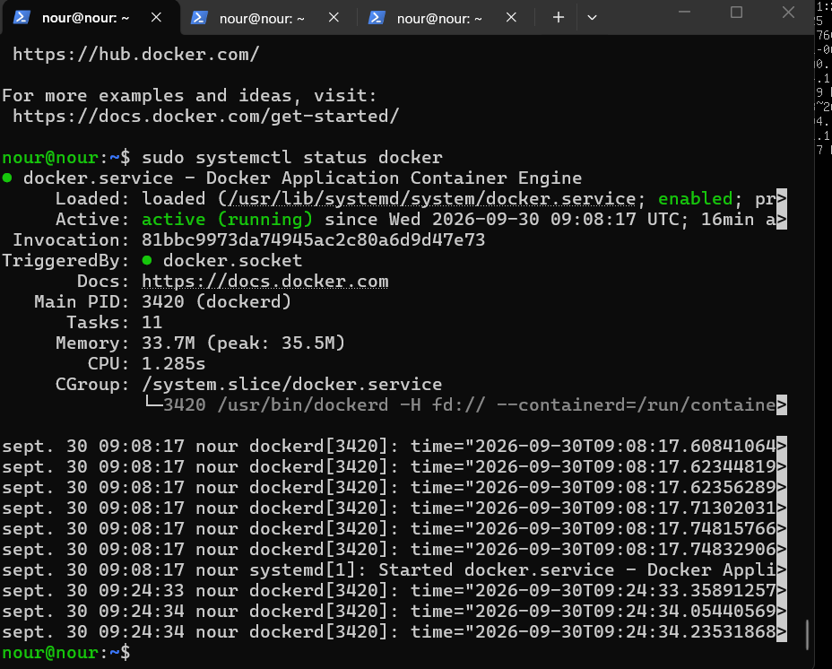

---

## 4. Installation de Jenkins en tant que service

```bash
sudo apt install -y fontconfig openjdk-21-jre
java -version

sudo wget -O /etc/apt/keyrings/jenkins-keyring.asc https://pkg.jenkins.io/debian-stable/jenkins.io-2026.key
echo "deb [signed-by=/etc/apt/keyrings/jenkins-keyring.asc] https://pkg.jenkins.io/debian-stable binary/" | sudo tee /etc/apt/sources.list.d/jenkins.list > /dev/null
sudo apt update
sudo apt install -y jenkins
sudo systemctl enable --now jenkins
sudo systemctl status jenkins
sudo cat /var/lib/jenkins/secrets/initialAdminPassword
```

> Problème rencontré : avec l'ancienne clé `jenkins.io-2023.key`, `apt update` renvoyait `NO_PUBKEY 7198F4B714ABFC68`, car Jenkins a changé sa clé de signature. Utiliser `jenkins.io-2026.key` a résolu le problème.

Vérification depuis la machine physique : `http://192.168.237.130:8080`, avec installation des plugins suggérés et création de l'utilisateur admin.

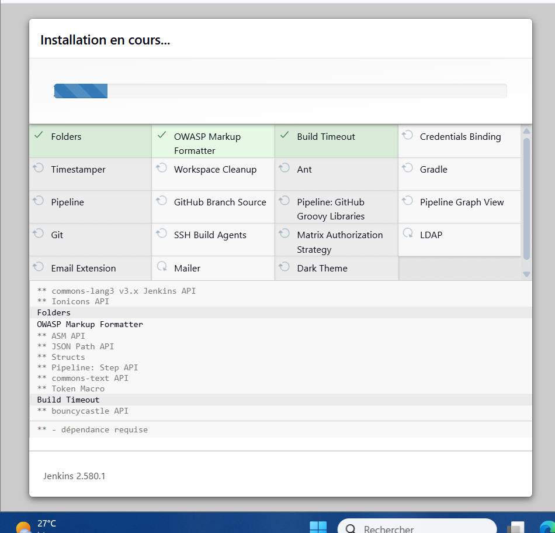
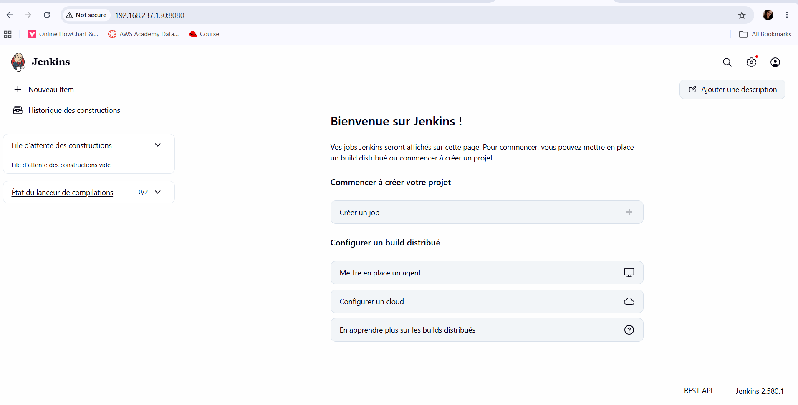


---

## 5. Mini CV One Page (HTML5 / CSS3 / JavaScript)

Le CV est dans le dossier [`cv/`](cv/) (`index.html`, `style.css`, `script.js`). Il propose un mode sombre mémorisé et un bouton d'impression / export PDF.

```powershell
mkdir tp-devops; cd tp-devops
git init -b main
git add .
git commit -m "Ajout du mini CV one page"
```

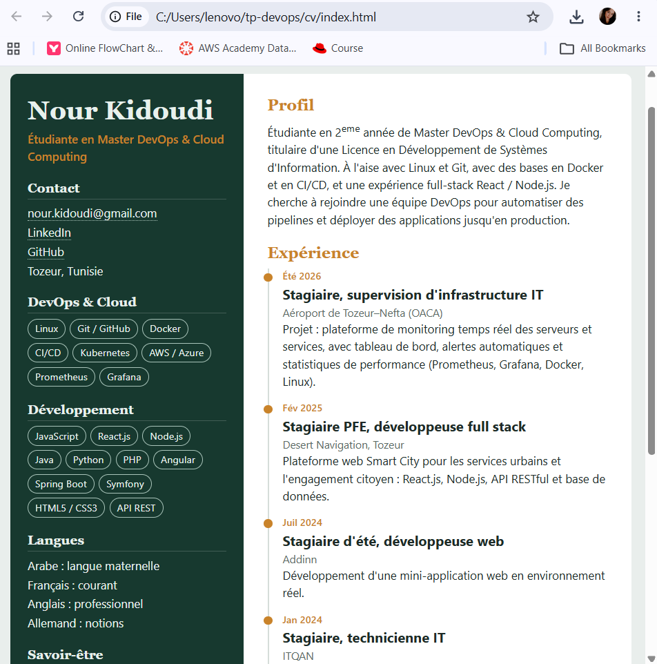

---

## 6. Push GitHub via SSH

Affichage de la clé publique, ajoutée sur GitHub (*Settings → SSH and GPG keys → New SSH key*) :

```powershell
type $env:USERPROFILE\.ssh\id_ed25519.pub
```

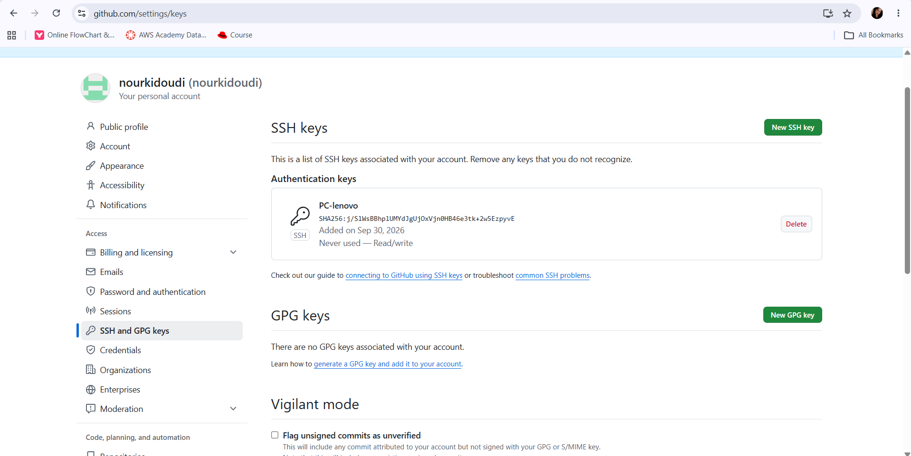

Test de l'authentification :

```powershell
ssh -T git@github.com
```

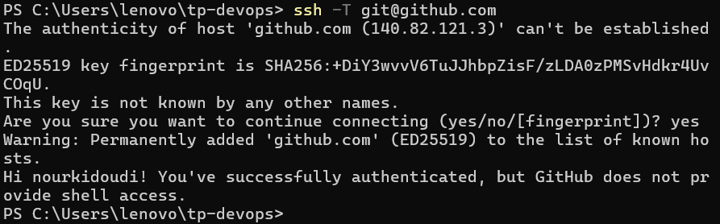

Configuration du dépôt local pour utiliser SSH et push :

```powershell
git remote add origin git@github.com:nourkidoudi/tp-devops.git
git remote -v
git push -u origin main
```

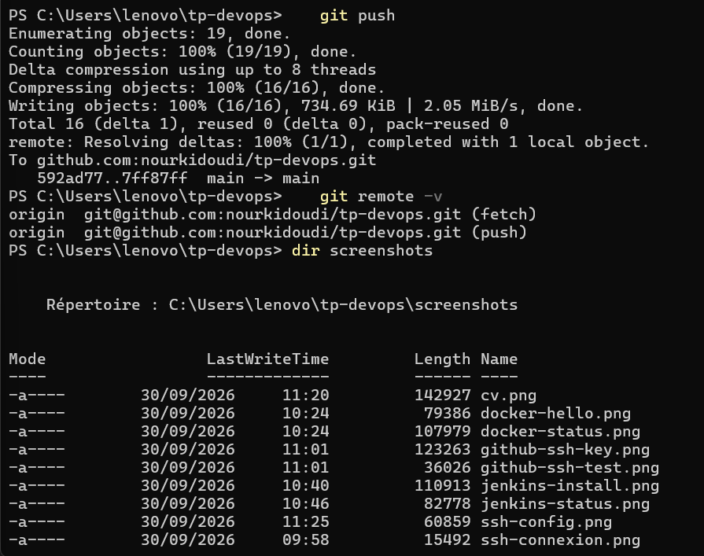

---

## 7. Évolution : application « DevSecOps Portfolio »

Le mini CV devient une petite application web dans le dossier [`portfolio/`](portfolio/) (`index.html`, `style.css`, `script.js`, `Dockerfile`). L'ancienne version reste dans [`cv/`](cv/).

**Sections :** About, Skills, Projects, Experience, Contact.

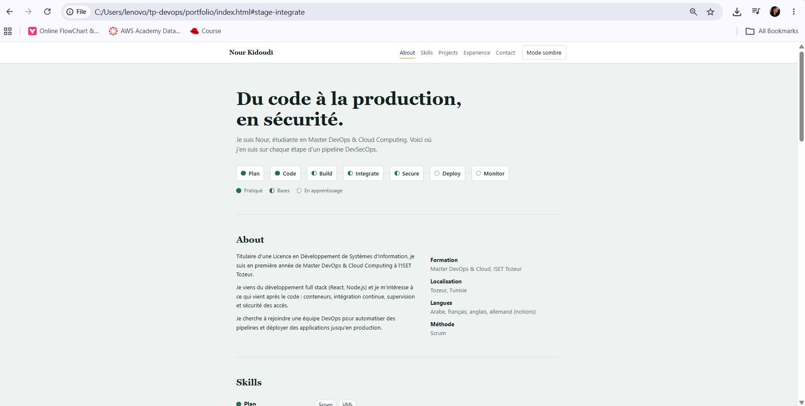

### Principales améliorations

- **Skills présentées comme un pipeline DevSecOps** (Plan, Code, Build, Integrate, Secure, Deploy, Monitor), chaque étape avec son niveau réel : pratiqué, bases ou en apprentissage.
- **Application pilotée par les données** : projets, compétences et expériences sont des tableaux dans `script.js`, la page est générée dynamiquement.
- **Projets filtrables** par catégorie (DevSecOps, Web, Monitoring).
- **Navigation** avec menu fixe et section active mise en évidence.
- **Formulaire de contact** avec validation, qui ouvre le client mail (aucun serveur ni service tiers).
- **Mode sombre** qui suit la préférence du système et mémorise le choix, page responsive et accessible (focus visible, mouvement réduit respecté).
- **Sécurité de la page** : politique CSP stricte (aucun script ni style externe), affichage des données avec `textContent` et non `innerHTML`, liens externes en `rel="noopener noreferrer"`.
- **Conteneurisation** : `Dockerfile` basé sur nginx sans droits root.

### Lancer le portfolio

En local : ouvrir `portfolio/index.html` dans le navigateur.

Dans un conteneur, sur la VM :

```bash
cd portfolio
docker build -t portfolio .
docker run -d --name portfolio -p 8081:8080 portfolio
```
Puis ouvrir `http://192.168.237.130:8081` depuis la machine physique (autoriser le port avec `sudo ufw allow 8081/tcp`).


## 8. Section « DevSecOps Skills »

Une section **DevSecOps Skills** est ajoutée au portfolio ([`portfolio/`](portfolio/)). Elle affiche les 7 technologies demandées :

- **Utilisés dans ce projet :** Git, Docker, Jenkins, avec pour chacun l'usage réel (dépôt GitHub en SSH, conteneurs sur la VM, Jenkins installé comme service).
- **Prochaines étapes :** Kubernetes, Ansible, Terraform, Argo CD, affichés comme « à découvrir » avec leur rôle (orchestration, configuration as code, infrastructure as code, GitOps).

Chaque carte indique le rôle de l'outil et un niveau (pratiqué, bases ou à découvrir), ce qui reste fidèle à ce qui a été réalisé.


## 9. Section « Projects » générée dynamiquement en JavaScript

Les projets ne sont pas écrits en HTML : ils sont décrits dans un **tableau d'objets** (`PROJECTS` dans [`portfolio/script.js`](portfolio/script.js)), et la page est construite à partir de ce tableau. Pour ajouter un projet, il suffit d'ajouter un objet, sans toucher au HTML.

```javascript
const PROJECTS = [
  { cat: 'DevSecOps', title: 'VM DevSecOps sécurisée',
    text: 'Ubuntu Server 26.04, accès SSH par clé, pare-feu, Docker et Jenkins en service.',
    tags: ['Linux', 'SSH', 'Docker', 'Jenkins'],
    link: 'https://github.com/nourkidoudi/tp-devops' },
  { cat: 'Web', title: 'Smart City Web Platform',
    text: 'Plateforme pour les services urbains et l\'engagement citoyen.',
    tags: ['React.js', 'Node.js', 'API REST'] },
  // ...
];

function renderProjects(filter) {
  const ul = document.getElementById('project-list');
  ul.replaceChildren();
  PROJECTS.filter(p => filter === 'Tous' || p.cat === filter).forEach(p => {
    const li = el('li');
    li.dataset.cat = p.cat;
    li.appendChild(el('h3', '', p.title));
    li.appendChild(el('p', 'cat', p.cat));
    li.appendChild(el('p', '', p.text));
    li.appendChild(tagList(p.tags));
    ul.appendChild(li);
  });
}
```

Le code fait trois choses :
- `PROJECTS.filter(...)` sélectionne les projets selon la catégorie choisie ;
- `forEach` crée un bloc de page par objet (titre, catégorie, description, technologies, lien) ;
- les boutons de filtre (Tous, DevSecOps, Web, Monitoring) sont eux aussi générés à partir du tableau et appellent `renderProjects`.

Le texte est inséré avec `textContent` (fonction `el`), jamais avec `innerHTML`, ce qui évite l'injection de code.

**Résultat :**

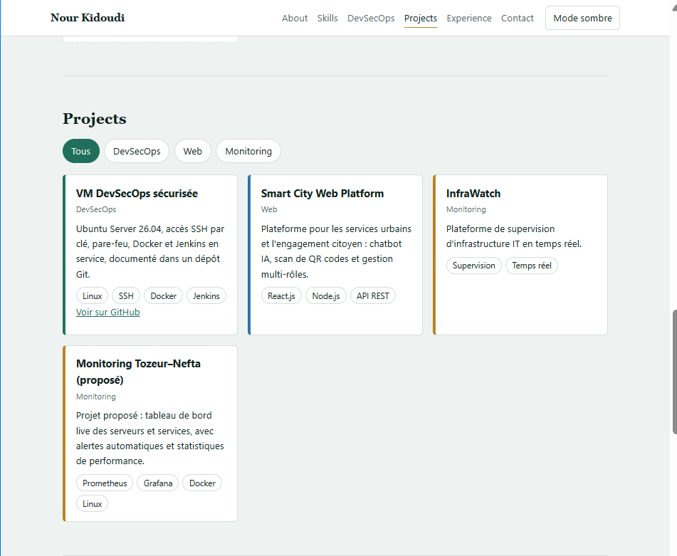

---
---
## 10. Dockerisation initiale

Le portfolio est servi par **Nginx** dans un conteneur grâce au fichier [`portfolio/Dockerfile`](portfolio/Dockerfile) :

```dockerfile
# Image Nginx qui s'exécute sans droits root (écoute sur le port 8080)
FROM nginxinc/nginx-unprivileged:alpine

# Copie des fichiers statiques du portfolio dans le dossier servi par Nginx
COPY index.html style.css script.js /usr/share/nginx/html/

# Port d'écoute du conteneur
EXPOSE 8080
```

**Explication :**
- `FROM nginxinc/nginx-unprivileged:alpine` : image officielle de Nginx, légère (Alpine) et exécutée sans droits root, ce qui limite les risques.
- `COPY ...` : le portfolio est un site statique, il suffit de copier ses trois fichiers dans le dossier que Nginx sert par défaut.
- `EXPOSE 8080` : cette image écoute sur le port 8080 (sans droits root, le port 80 n'est pas utilisable).

---
## 11. Construction de l'image Docker `cv-docker`

Commande utilisée sur la VM, dans le dossier `portfolio/` qui contient le Dockerfile :

```bash
docker build -t cv-docker .
```

- `docker build` construit une image à partir du Dockerfile ;
- `-t cv-docker` donne le nom `cv-docker` à l'image ;
- `.` indique que le Dockerfile se trouve dans le dossier courant.

Vérification avec `docker images cv-docker` :

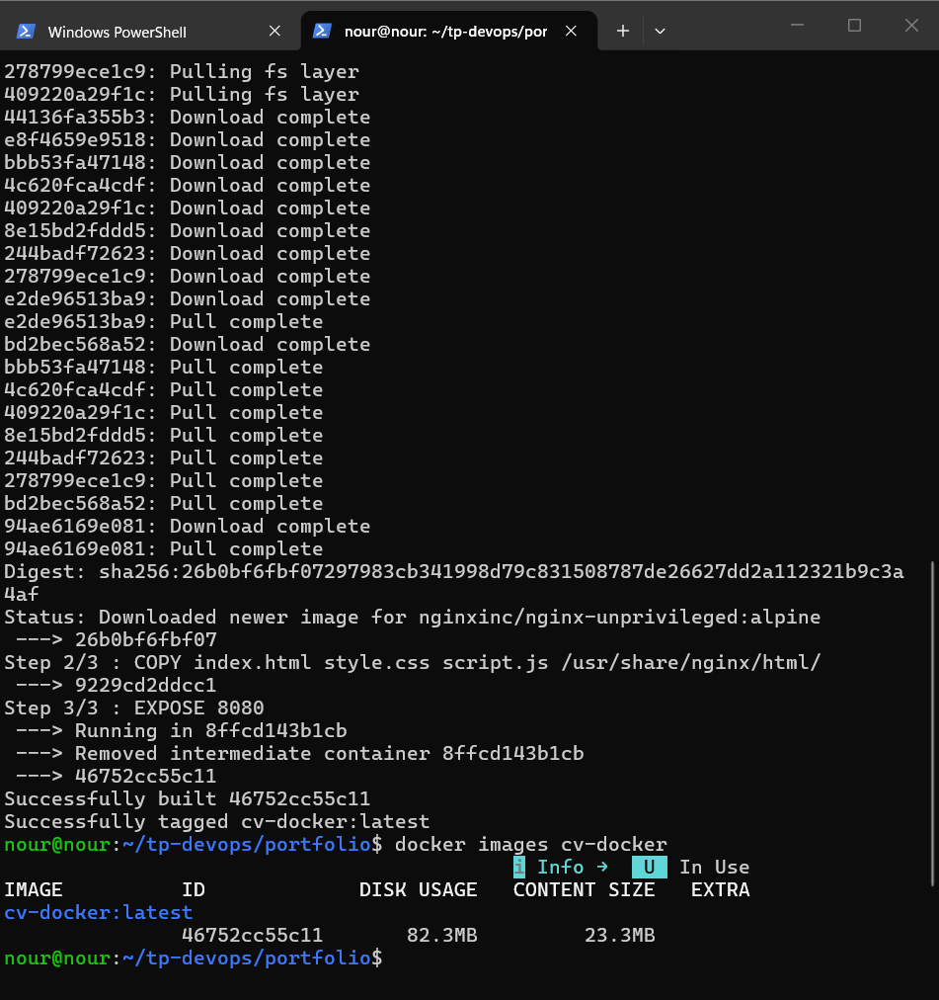

---
## 12. Exécution du conteneur et accès depuis la machine physique

Commande utilisée sur la VM :

```bash
docker run -d --name cv-docker -p 8081:8080 cv-docker
```

- `-d` : exécution en arrière-plan ;
- `--name cv-docker` : nom du conteneur ;
- `-p 8081:8080` : le port 8081 de la VM est redirigé vers le port 8080 du conteneur (Nginx) ;
- `cv-docker` : image construite à l'étape 11.

Le port est ouvert dans le pare-feu avec `sudo ufw allow 8081/tcp`.

Résultat de `docker ps` :

```
COLLER ICI LA SORTIE RÉELLE DE docker ps
```

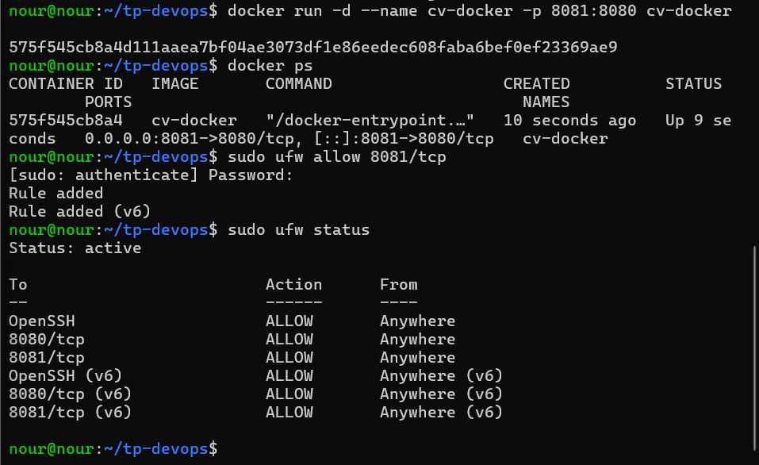

Accès depuis la machine physique sur `http://192.168.237.130:8081` :

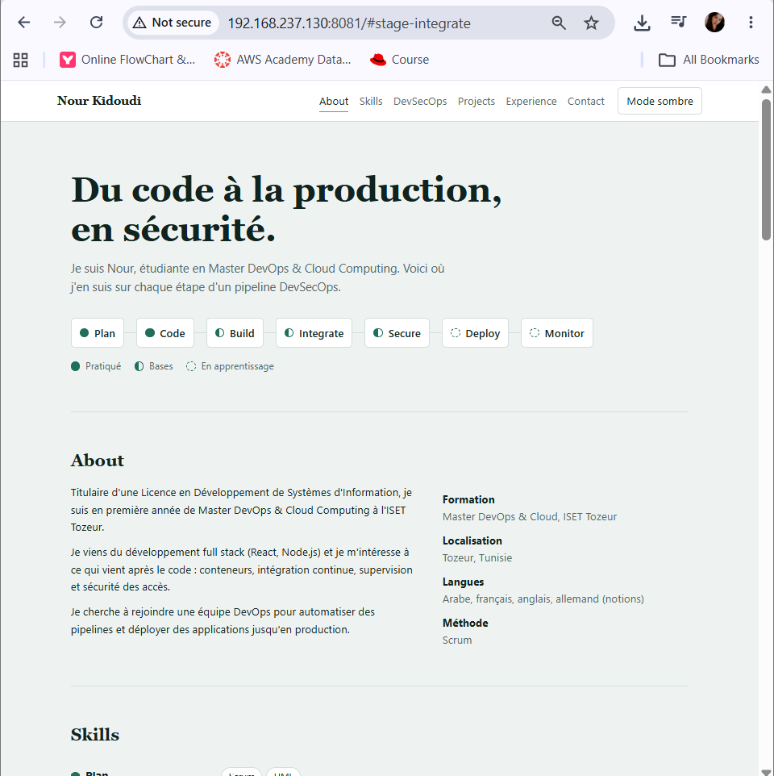

---
**Dépôt :** https://github.com/nourkidoudi/tp-devops
